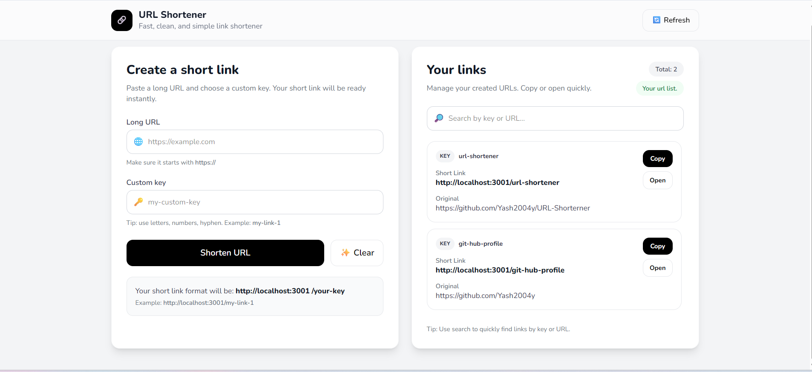

# 🔗 URL Shortener

A **fast, clean, and simple URL Shortener** built as a learning project using **Node.js**, **HTML**, and **Tailwind CSS**.  
This project uses a **JSON file for data storage** instead of a database, making it ideal for understanding backend fundamentals.

---

## 📸 Screenshots


---

## ✨ Features

- 🔹 Shorten long URLs instantly
- 🔹 Custom short keys (e.g. `/my-link`)
- 🔹 Redirect short URL → original URL
- 🔹 JSON file based storage (no database)
- 🔹 View all created URLs
- 🔹 Search URLs by key or original URL
- 🔹 Responsive & clean UI using Tailwind CSS

---

## 🛠️ Tech Stack

- **Backend:** Node.js (Core HTTP module)
- **Frontend:** HTML, Tailwind CSS
- **Language:** JavaScript
- **Storage:** JSON file

---
## 📂 Project Structure

```text
url-shortener/
│
├── node_modules/             # Project dependencies
│
├── .env                      # Environment variables
├── .gitignore                # Git ignored files
├── .node-version             # Node.js version configuration
│
├── db.js                     # JSON database read/write logic
├── FileHelper.js             # Helper functions (file handling, content type, etc.)
│
├── index.html                # Frontend UI
│
├── server.js                 # Node.js HTTP server and routing
│
├── URL_HELPER_DB.json        # JSON file used as data storage
│
├── package.json              # Project metadata & scripts
├── package-lock.json         # Dependency lock file
│
└── README.md                 # Project documentation
